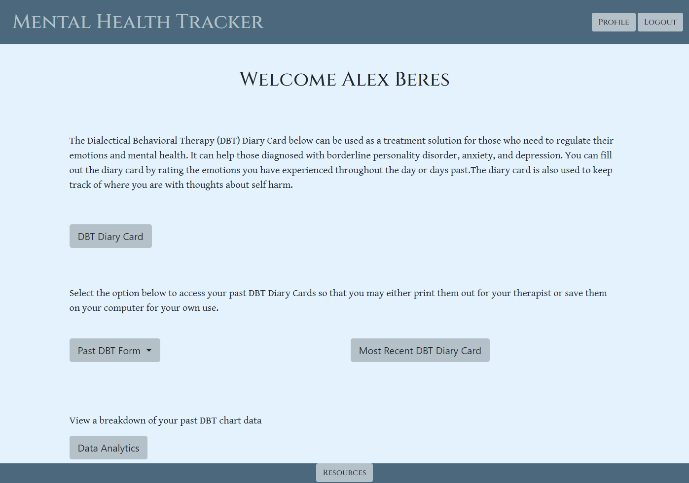

# Mental Health Tracker

## Description

This full stack application allows users to fill out DBT Diary cards, view and print former cards, and track their progress over time via Chart JS. It also allows for healthcare providers to add patients to their roster, and view their filled out DBT cards.

## Table of Contents
  * [Installation](#installation)
  * [Usage](#usage)
  * [Questions](#questions)
  * [License](#license)
    
    
## Installation
    
  _Follow these steps to install this application:_

  None required.
      
## Usage

  _Instructions for use:_

  Navigate to the deployed URL, and make an account.  From your profile, you can fill out new diary cards, or view past.  Create a healthcare provider account instead if you wish to manage patients.  You can add patients via email on your profile.
  
  
        
  [Link to deployed project](https://mental-health-tracker-dbt.herokuapp.com/)

## Technologies Used
  [Chart JS](https://www.chartjs.org/)
  [HTML2PDF](https://github.com/eKoopmans/html2pdf.js)
## Questions
      
  If you have any questions, please reach out via Github or my email.
  
  _Contact Info:_

  GitHub: [Alex Beres](https://github.com/alextheshire)
          [Juan Diego Lanata](https://github.com/JDLanata)
          [Jonathan Singh](https://github.com/jmsingh9899)
          [Christian Nirschl](https://github.com/ChrisNirschl1)

  Email: [Alex Beres](mailto:aalexbberes@gmail.com)
         [Juan Diego Lanata](mailto:JuanDL456@gmail.com)
         [Jonathan Singh](mailto:jmsingh9899@gmail.com)
         [Christian Nirschl](mailto:christiannirschl6@gmail.com)
    
## License

      
  _This application has the MIT License._
      
  For more information please view the [license description](https://choosealicense.com/licenses/MIT).
  
  
